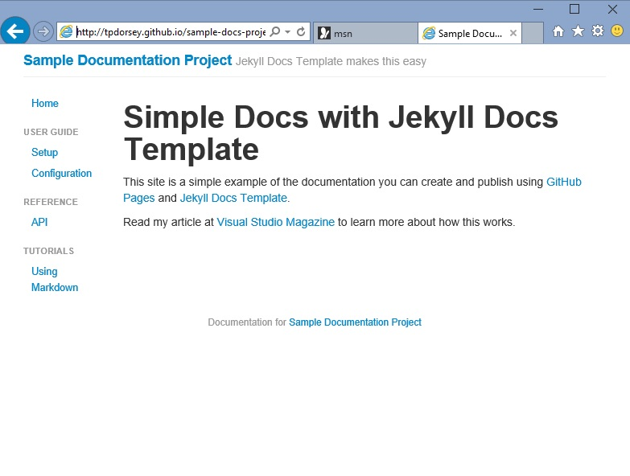

# Markdown Examples

Paragraphs are separated by a blank line.

*Italic*, **bold**, and `monospace`. Here's a ~~strikeout~~.

Itemized lists look like:

  * this one
  * that one
  * the other one

Here's a link to the [Markdown basics](http://daringfireball.net/projects/markdown/basics).

Here's a link to a [local doc](../index.html), and to a [section heading in the current doc](#an-h2-header).

Here's an image:



> Block quotes are
> written like so.
>
> They can span multiple paragraphs,
> if you like.

## An h2 header

Here's a numbered list:

 1. first item
 2. second item
 3. third item

Here's an ```inline``` code example.

Here's a code sample:

```
define foobar() {
    print "Welcome to flavor country!";
}
```

You can optionally mark the delimited block with the language for syntax highlighting in some parsers:

```python
import time
# Quick, count to ten!
for i in range(10):
    # (but not *too* quick)
    time.sleep(0.5)
    print i
```

### An h3 header

There are a number of table formats (which comes from MarkdownExtended), but the format best supported by GitHub looks like this:

| size | material     | color        |
| ---- | ------------ | ------------ |
| 9    | leather      | brown        |
| 10   | hemp canvas  | natural      |
| 11   | glass        | transparent  |

Here's the whole thing as raw text:

    # Markdown Examples

    Paragraphs are separated by a blank line.

    *Italic*, **bold**, and `monospace`. Here's a ~~strikeout~~.

    Itemized lists look like:

      * this one
      * that one
      * the other one

    Here's a link to the [Markdown basics](http://daringfireball.net/projects/markdown/basics).

    Here's a link to a [local doc](local-doc.html), and to a [section heading in the current doc](#an-h2-header).

    Here's an image:

    

    Here's an image:

    

    > Block quotes are
    > written like so.
    >
    > They can span multiple paragraphs,
    > if you like.

    ## An h2 header

    Here's a numbered list:

     1. first item
     2. second item
     3. third item

    Here's a code sample:

    ```
    define foobar() {
        print "Welcome to flavor country!";
    }
    ```

    You can optionally mark the delimited block with the language for syntax highlighting in some parsers:

    ```python
    import time
    # Quick, count to ten!
    for i in range(10):
        # (but not *too* quick)
        time.sleep(0.5)
        print i
    ```

    ### An h3 header

    There are a number of table formats (which comes from MarkdownExtended), but the format best supported by GitHub looks like this:

    | size | material     | color        |
    | ---- | ------------ | ------------ |
    | 9    | leather      | brown        |
    | 10   | hemp canvas  | natural      |
    | 11   | glass        | transparent  |

